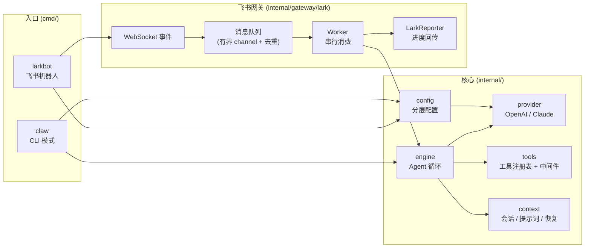
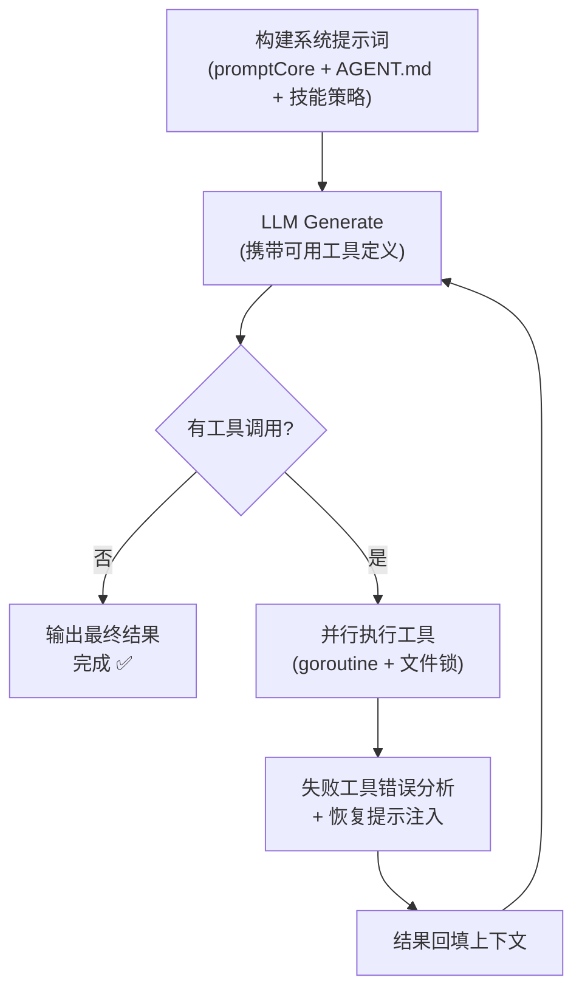

<div align="center">

# 🦞 tiny-claw

**轻量级 AI 编程 Agent 框架** —— 一个用 Go 编写的个人 AI 助手，可在终端或飞书（Lark）中驱动大模型完成编程任务。


[✨ 特性](#-特性) · [🚀 快速开始](#-快速开始) · [⚙️ 配置](#️-配置) · [🏗️ 架构](#️-架构总览) · [📚 技能系统](#-技能系统) · [🛡️ 审批机制](#️-审批机制) · [📁 项目结构](#-项目结构)

</div>

---

## ✨ 特性

- **双入口模式**
  - 🖥️ **CLI 模式**：`claw <prompt>`，一行命令把任务交给 Agent 在终端中执行
  - 💬 **飞书（Lark）机器人模式**：在聊天中直接对话，支持卡片式审批
- **多模型 Provider**：OpenAI 兼容协议（默认智谱 GLM 底座，兼容 DeepSeek 等）与 Anthropic Claude
- **Agent 循环引擎**：系统提示词构建 → LLM 生成 → **并行工具调用** → 结果回填，循环直至任务完成
- **内置工具集**：读/写/编辑/删除文件、执行 shell 命令、派生子 Agent
- **技能系统（Skill-as-Tool）**：`.claw/skills/` 下的技能按需加载，避免全量注入导致的 token 爆炸
- **危险操作审批**：`rm -r`、`sudo` 等高危命令须经人工确认（终端交互 / 飞书审批卡片），超时 fail-closed
- **多轮会话与上下文压缩**：会话持久化 + LLM 摘要压缩，长对话不失控
- **工程化安全设计**：工作区路径逃逸防护、原子写入、文件读写锁、输出截断、优雅退出
- **可观测性**：结构化日志（slog）、Span 追踪导出、Token 成本追踪

## 🚀 快速开始

### 环境要求

- Go 1.26+
- 一个大模型 API Key（OpenAI 兼容端点或 Anthropic）

### 安装

```bash
git clone https://github.com/aethelgards/tiny-claw.git
cd tiny-claw
go build -o claw ./cmd/claw
go build -o larkbot ./cmd/larkbot
```

### 配置

配置按 **默认值 → 全局 → 项目 → 本地 → 环境变量** 的优先级分层合并（与 Claude Code 的 settings 模式同构）：

```
~/.claw/settings.json           # 全局配置（可选）
.claw/settings.json             # 项目配置（可选）
.claw/settings.local.json       # 本地私有配置（可选，通常 gitignore）
CLAW_* 环境变量                 # 最高优先级
```

最小配置示例（`~/.claw/settings.json` 或 `CLAW_*` 环境变量）：

```json
{
  "provider": "openai",
  "model": "glm-4.6",
  "apiKey": "your-api-key",
  "baseURL": "https://open.bigmodel.cn/api/paas/v4/",
  "workDir": "."
}
```

对应环境变量：

```bash
export CLAW_PROVIDER=openai
export CLAW_MODEL=glm-4.6
export CLAW_API_KEY=your-api-key
export CLAW_BASE_URL=https://open.bigmodel.cn/api/paas/v4/
export CLAW_WORK_DIR=.
```

### 运行 CLI

```bash
./claw "给这个项目添加单元测试"
```

Agent 会自主读取代码、修改文件、执行命令，直到完成任务。遇到高危命令（如 `rm -r`）会暂停并请求你的确认：

```
⚠️ 高危操作审批请求
工具: bash
参数: rm -rf build/
任务 ID: 123456
允许执行? (y/N): 
```

### 运行飞书机器人

1. 在[飞书开放平台](https://open.feishu.cn/)创建应用，获取 `App ID` 与 `App Secret`
2. 开启机器人能力，并添加 `im:message` 等事件订阅（WebSocket 长连接方式，无需公网回调地址）
3. 配置并启动：

```json
{
  "larkAppId": "cli_xxxxxxxx",
  "larkAppSecret": "xxxxxxxxxxxxxxxx",
  "larkChannelSize": 64
}
```

```bash
./larkbot
```

之后在飞书中私聊或群聊 @机器人 即可对话。危险命令会以**审批卡片**的形式推送到会话中，点击「允许/拒绝」完成审批。

## ⚙️ 配置

| 字段 | JSON 键 | 环境变量 | 默认值 | 说明 |
|---|---|---|---|---|
| Provider | `provider` | `CLAW_PROVIDER` | `openai` | `openai` \| `claude` |
| 模型 | `model` | `CLAW_MODEL` | — | 必填，如 `glm-4.6` |
| API Key | `apiKey` | `CLAW_API_KEY` | — | 必填 |
| API 端点 | `baseURL` | `CLAW_BASE_URL` | 智谱兼容端点 | OpenAI 兼容地址 |
| 最大 Token | `maxTokens` | `CLAW_MAX_TOKENS` | `4096` | 单次生成上限 |
| 慢思考 | `enableThinking` | `CLAW_ENABLE_THINKING` | `false` | 是否开启思考过程 |
| 工作目录 | `workDir` | `CLAW_WORK_DIR` | `.` | Agent 操作的工作区 |
| 计划模式 | `planMode` | — | `false` | 影响系统提示词策略 |
| 飞书 App ID | `larkAppId` | `CLAW_LARK_APP_ID` | 空 | 仅 larkbot 模式 |
| 飞书 App Secret | `larkAppSecret` | `CLAW_LARK_APP_SECRET` | 空 | 仅 larkbot 模式 |
| 队列容量 | `larkChannelSize` | `CLAW_LARK_CHANNEL_SIZE` | `64` | 消息队列缓冲上限 |
| 审批超时 | `approvalTimeout` | `CLAW_APPROVAL_TIMEOUT` | `5m` | Go duration 字符串 |
| 日志 | `log` | — | 见下方 | `level` / `format` / `logDir` 等 |

## 🔧 内置工具

| 工具 | 说明 | 安全约束 |
|---|---|---|
| `read_file` | 读取文件内容 | 限 64 MiB，路径必须位于工作区内 |
| `write_file` | 写入文件 | 原子写入（临时文件 + rename），工作区路径约束 |
| `edit_file` | 精确字符串替换编辑 | 工作区路径约束 + 文件锁 |
| `delete_file` | 删除文件 | 工作区路径约束 |
| `bash` | 执行 shell 命令 | 默认 120s 超时，输出截断 8 KB，全局文件锁 |
| `spawn_subagent` | 派生子 Agent 并行处理 | 复用 provider 配置 |
| 技能工具 | 按需加载 `.claw/skills/` 技能正文 | 正文截断 32 KB |

**并发安全**：进程级读写锁（`internal/tools/filelock.go`）保证同一路径的读/写串行化、不同路径并行化；`bash` 因可能触碰任意文件而持有全局排他锁。

## 🏗️ 架构总览



**Agent 循环**（`internal/engine/loop.go`）：



**飞书异步管道**：事件回调只做「解析 → 过滤 → 去重 → 入队」，**微秒级返回**，绝不阻塞 WebSocket；有界队列（默认 64）满则丢弃并记日志，单 worker 串行消费保证全量有序；收到 `SIGINT`/`SIGTERM` 时处理完当前消息再优雅退出。

## 📚 技能系统

技能以 `技能名/SKILL.md` 的形式组织在 `.claw/skills/` 下，frontmatter 声明 `name` 与 `description`：

```markdown
---
name: tdd-workflow
description: 编写新功能或修复 bug 时使用，强制测试驱动开发
---

# TDD 工作流
（完整执行指南...）
```

设计要点：

- **Skill-as-Tool**：每个技能注册为一个工具，模型每轮只看到「技能名 + description」（O(N×描述)），仅在任务匹配时才调用工具加载正文 —— 相比全量注入（O(N×正文)）避免了 token 爆炸
- **零架构侵入**：复用引擎已有的 tool call → 执行 → 回填循环
- **可靠性**：技能正文 32 KB 截断保护，坏格式技能跳过并告警，重名技能跳过不 panic

## 🛡️ 审批机制

命中高危模式（`rm -r`、`sudo`、`drop`、重定向写 `.go` 文件等）的 `bash` 调用会被 `ApprovalMiddleware` 拦截：

- **CLI 模式**：终端交互 `[y/N]` 确认；非交互 stdin 一律拒绝
- **飞书模式**：审批卡片推送到会话，仅发起者本人可审批
- **超时 fail-closed**：默认 5 分钟（`approvalTimeout` 可调），超时自动拒绝；审批通知发送失败同样拒绝执行

## 🧠 会话与上下文管理

- **多轮会话**：`Session` 持久化到磁盘（`.claw/sessions/`），跨请求保留工作记忆
- **上下文压缩**：会话达到阈值（基于模型 context window × 压缩比例）时，由 LLM 摘要器将旧对话压缩为中文摘要，防止长对话撑爆上下文；摘要失败自动回退为纯截断
- **成本追踪**：`CostTracker` 记录每轮 token 用量与费用
- **错误自愈**：`RecoveryManager` 分析失败的工具调用并向模型注入修复提示；连续失败的指纹去重避免重复注入

## 📁 项目结构

```
├── cmd/
│   ├── claw/                  # CLI 模式入口
│   └── larkbot/               # 飞书机器人入口
├── internal/
│   ├── approval/              # 审批管理器、中间件、终端/卡片 reporter
│   ├── config/                # 分层配置加载 + slog 初始化
│   ├── context/               # 会话、提示词组合器、技能加载、错误恢复
│   ├── engine/                # Agent 循环、摘要器、子 Agent、提醒注入
│   ├── gateway/lark/          # 飞书网关：消息解析、队列、worker、审批卡片
│   ├── helper/                # JSON / Map 工具
│   ├── observability/         # 成本追踪
│   ├── provider/              # OpenAI 兼容 / Claude Provider
│   ├── reporter/              # Reporter 接口
│   ├── schema/                # 消息 / 工具调用 / 工具定义模型
│   ├── subagent/              # 子 Agent 相关
│   ├── tools/                 # 工具注册表、内置工具、文件锁
│   └── trace/                 # Span 追踪与导出
```

## 🧪 测试

```bash
go build ./...   # 编译检查
go vet ./...     # 静态检查
go test ./...    # 运行测试
```

## 📄 License

[MIT](LICENSE) © 2026 aethelgards
