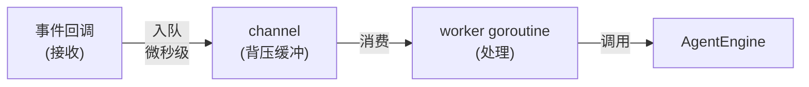
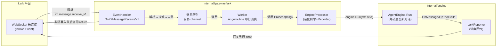
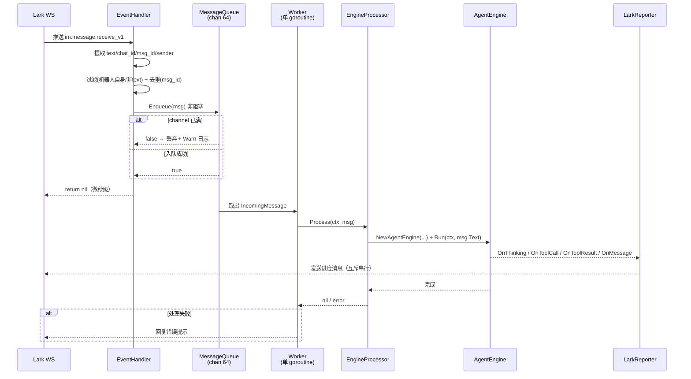
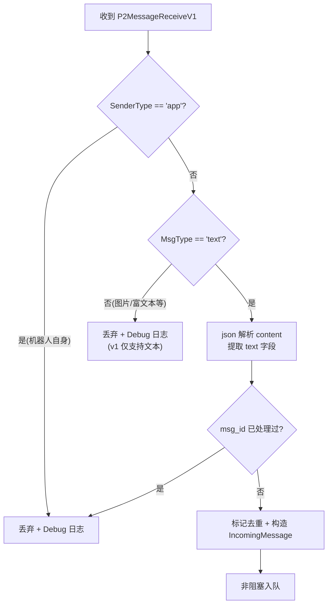
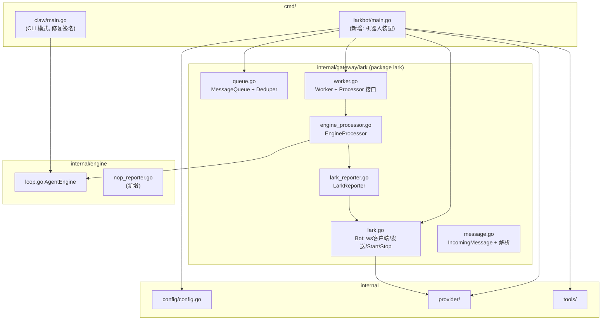
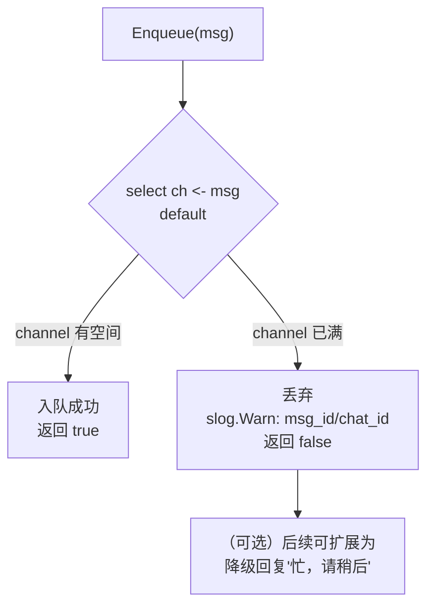
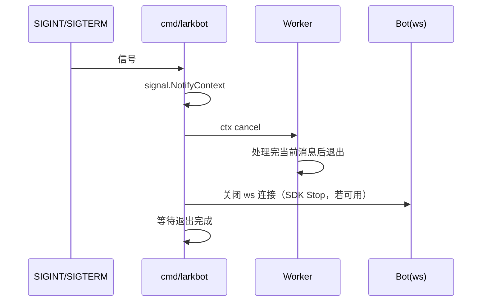

# tiny-claw Lark 异步消息处理管道设计

日期：2026-08-09
状态：已获用户确认（并发模型 / 会话 / 背压 / 接入方式 四项决策已拍板）

## 1. 背景与目标

tiny-claw 需要接入 Lark（飞书）作为 AI 助手入口：用户在聊天中发消息，机器人调用 Agent 引擎处理并回复结果。

现状问题：

- `internal/gateway/lark/lark.go` 是官方 SDK 示例草稿：`package main` 错置于 `internal/` 下、凭据硬编码在源码中、handler 引用未定义变量，**无法编译**。
- `internal/gateway/lark/lark_reporter.go` 同样 `package main`，`NewReporter` 引用不存在的字段，接口未实现。
- `cmd/claw/main.go` 以 3 参调用 `engine.NewAgentEngine`，但 `loop.go` 已改为 4 参签名（reporter），**已过期**。

目标：

1. 建立「消息 → channel → 立即返回 → 后台 goroutine 消费 → 引擎处理 → 回复」的异步管道。
2. 事件回调**微秒级返回**，绝不阻塞 WebSocket 事件处理，避免触发 Lark 重试。
3. 修复上述结构性问题，将凭据移入配置层。

## 2. 需求分析与设计决策

### 2.1 为什么需要 channel 解耦

Lark 事件回调（此处为 WebSocket 长连接事件 handler）要求快速返回。而 Agent 引擎一轮任务可能持续数分钟（多轮思考 + 工具调用），若在回调内同步执行：

- WebSocket 连接的事件处理被阻塞，后续事件堆积；
- 引擎失败时无法干净地隔离，回调语义被拉长。

因此将「接收」与「处理」通过有界 channel 解耦：



### 2.2 已确认的设计决策

| # | 决策点 | 结论 | 理由 |
|---|---|---|---|
| 1 | 消费并发模型 | **单 worker 串行** | 实现最简单、全量有序；当前个人助手场景并发量低，可接受排队 |
| 2 | 会话记忆 | **独立会话**，每消息一次 `Run` | 与现有 `engine.Run` 一致，改动最小；`IncomingMessage` 保留 chat_id 供将来扩展会话层 |
| 3 | 背压策略 | **有界 buffer + 非阻塞入队，满则丢弃并记日志** | 回调永远即时返回；极端流量/重启丢消息在个人场景可接受 |
| 4 | 事件接入 | **保持 WebSocket 长连接（larkws）** | 无需公网回调地址与签名验证，与现有代码一致 |

## 3. 总体架构



组件职责：

| 组件 | 职责 | 不做什么 |
|---|---|---|
| EventHandler | 解析事件、提取文本、过滤、去重、入队、返回 | 不做任何 LLM / 工具调用 |
| MessageQueue | 有界缓冲 + 非阻塞入队 + msg_id 去重 | 不解析消息内容 |
| Worker | 串行消费、panic 恢复、失败回复 | 不感知 Lark 协议细节 |
| EngineProcessor | 按消息装配独立 engine + reporter 并运行 | 不持有跨消息状态 |
| LarkReporter | 把引擎进度/结果发回原 chat | 不阻塞引擎主流程 |

## 4. 核心数据流（时序）



## 5. 核心数据结构与消息解析

### 5.1 IncomingMessage

```go
// internal/gateway/lark/message.go
type IncomingMessage struct {
    MessageID string // 去重键（Lark 消息全局唯一）
    ChatID    string // 回复目标 chat_id（群聊/私聊通用）
    OpenID    string // 发送者 open_id（备用字段，将来可做权限）
    TenantKey string // 租户 key，发送回复时透传
    Text      string // 解析出的纯文本
}
```

### 5.2 解析与过滤规则



- `content` 为 JSON 字符串，如 `{"text":"你好"}`；仅 `msg_type == "text"` 进入管道，其余类型记录日志后忽略。
- `sender.sender_type == "app"` 直接过滤，防止机器人自回环。
- 去重防 WS 断线重连导致的重复投递（Lark 事件为 at-least-once 语义）。

## 6. 模块设计

### 6.1 包结构



### 6.2 各模块接口

```go
// queue.go —— 有界队列，入队永不阻塞
type MessageQueue struct { ch chan IncomingMessage }

func NewMessageQueue(size int) *MessageQueue
func (q *MessageQueue) Enqueue(msg IncomingMessage) bool // 满则返回 false
func (q *MessageQueue) Messages() <-chan IncomingMessage

// 去重器（独立小模块，TTL 过期自动清理；默认 TTL 10 分钟）
type Deduper struct{}
func NewDeduper(ttl time.Duration) *Deduper
func (d *Deduper) Seen(id string) bool // 首次 false，之后 true
```

```go
// worker.go —— 消费端，可注入 Processor 便于测试
type Processor interface {
    Process(ctx context.Context, msg IncomingMessage) error
}

// onError 可选回调：处理失败/panic 时由装配方注入，用于回复错误提示
type onError func(ctx context.Context, msg IncomingMessage, err error)

type Worker struct {
    queue     *MessageQueue
    processor Processor
    onError   onError // 可为 nil
}

func NewWorker(q *MessageQueue, p Processor, onError ...onError) *Worker
func (w *Worker) Run(ctx context.Context) // ctx.Done 时优雅退出
```

> 错误回复路径：Worker 不持有 bot。`cmd/larkbot` 装配时将「失败回复」作为 `onError` 注入（内部走 Bot.SendMessage）；Worker 测试注入 fake onError 即可断言失败行为。

```go
// engine_processor.go —— 每消息装配独立 engine + reporter
type EngineProcessor struct {
    provider provider.LLMProvider
    registry tools.Registry
    settings config.Settings
    bot      *Bot
}

func (p *EngineProcessor) Process(ctx context.Context, msg IncomingMessage) error {
    reporter := NewLarkReporter(p.bot, msg.ChatID, msg.TenantKey)
    agent := engine.NewAgentEngine(p.provider, p.registry, p.settings, reporter)
    return agent.Run(ctx, msg.Text)
}
```

## 7. 背压与可靠性



| 场景 | 行为 |
|---|---|
| channel 满 | 丢弃新消息，`Warn` 日志含 msg_id/chat_id 便于追溯 |
| worker panic | `recover` 捕获 → `Error` 日志 + 触发 `onError` 回复「处理消息时出错」，worker 存活继续消费 |
| engine.Run 返回 error | `Error` 日志 + 触发 `onError` 回复「处理失败：\<err\>」（截断到合理长度） |
| 回复发送失败 | 仅 `Error` 日志，不影响 worker 循环 |
| 进程重启 | 未消费消息丢失（内存队列，已确认接受） |

worker 循环骨架：

```go
func (w *Worker) Run(ctx context.Context) {
    for {
        select {
        case <-ctx.Done():
            return
        case msg := <-w.queue.Messages():
            w.safeProcess(ctx, msg) // 内含 recover
        }
    }
}
```

## 8. 配置项

扩展 `internal/config`，新增三个字段（CLI 模式不校验 lark 字段，bot 模式启动时校验）：

| 字段 | JSON 键 | 环境变量 | 默认值 |
|---|---|---|---|
| `LarkAppID` | `larkAppId` | `CLAW_LARK_APP_ID` | 空 |
| `LarkAppSecret` | `larkAppSecret` | `CLAW_LARK_APP_SECRET` | 空 |
| `LarkChannelSize` | `larkChannelSize` | `CLAW_LARK_CHANNEL_SIZE` | `64` |

凭据只从配置/环境变量读取，**删除源码中的硬编码**。

## 9. 并发与优雅退出



- `cmd/larkbot/main.go` 用 `signal.NotifyContext` 监听 `SIGINT`/`SIGTERM`。
- worker 消费 `ctx.Done()`，**处理完当前消息**才退出，不中断进行中的引擎任务。
- Bot 关闭依赖 larkws SDK 提供的停止能力（实现时核对 SDK API，不可用则以进程退出兜底）。

## 10. 测试计划

| 模块 | 用例 |
|---|---|
| message 解析 | text 消息提取成功；非 text（image/post）忽略；`sender_type=app` 过滤；content 含特殊字符安全解析 |
| queue | 正常入队出队；channel 满时 `Enqueue` 返回 false 且不阻塞；重复 msg_id 第二次入队被去重 |
| worker | fake Processor 记录调用序列（验证串行顺序）；Processor panic 后 worker 继续消费下一条；ctx 取消后优雅退出 |
| config | lark 字段默认值（channelSize=64）；`CLAW_LARK_*` 环境变量覆盖 |
| 冒烟 | 起服务发消息，日志链路 `receive → enqueue → consume → engine → reply` 完整 |

## 11. 涉及文件变更清单

| 文件 | 动作 | 说明 |
|---|---|---|
| `internal/gateway/lark/message.go` | 新增 | IncomingMessage + 事件解析/过滤 |
| `internal/gateway/lark/queue.go` | 新增 | 有界队列 + Deduper |
| `internal/gateway/lark/worker.go` | 新增 | Worker + Processor 接口 |
| `internal/gateway/lark/engine_processor.go` | 新增 | 装配 engine + reporter |
| `internal/engine/nop_reporter.go` | 新增 | 空实现 Reporter（CLI 模式用） |
| `internal/gateway/lark/lark.go` | 重构 | package main→lark；删除硬编码凭据与 main()；SendMessage 改 chat_id；增加 Start/Stop |
| `internal/gateway/lark/lark_reporter.go` | 重构 | package main→lark；实现 4 个回调，互斥串行发送 |
| `internal/config/config.go` | 修改 | 新增 lark 配置项与环境变量 |
| `cmd/larkbot/main.go` | 新增 | 机器人模式装配入口 |
| `cmd/claw/main.go` | 修改 | 修复 `NewAgentEngine` 签名（补 NopReporter） |
| 各模块 `_test.go` | 新增 | 按 §10 测试计划 |

## 12. 范围边界

- 仅处理 `msg_type == "text"`；富文本/图片/文件消息 v1 忽略。
- 不做会话记忆（独立会话已确认）；保留 chat_id 字段以便将来扩展。
- 不做消息持久化与重试（内存队列已确认接受）。
- 不引入新第三方依赖（标准库 + 现有 lark SDK 足够）。
- 不修改 engine 循环逻辑（`loop.go` 保持不变）。
