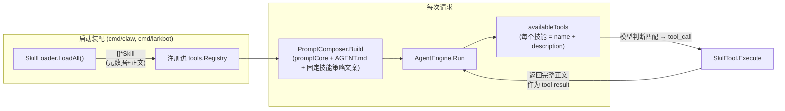
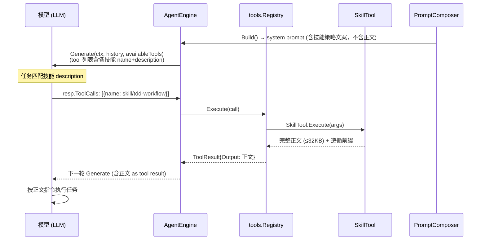

# tiny-claw Skill 技能模块设计（Skill-as-Tool）

日期：2026-08-09
状态：设计提案 v2（待用户确认后实施）
前置：v1（提示词注入方案）已实现并修复 3 个 bug，但因**全量注入导致的 token 爆炸**缺陷被否决，本文为工业级重设计。

## 1. 背景与目标

tiny-claw 需要在 `.claw/skills/` 下按 `技能名/SKILL.md` 组织外挂技能，让模型在符合 description 描述的场景下遵循技能正文指令。

### 1.1 v1 方案的根本缺陷：Token 爆炸

v1 方案把**所有技能正文全量拼入 system prompt**。实测 `.claw/skills/tdd-workflow/SKILL.md` 为 13,064 字节 ≈ **3.3K tokens**：

| 技能数 | 每次请求固定开销 |
|---|---|
| 10 | ~33K tokens |
| 50 | ~165K tokens（已超多数模型上下文） |
| 100 | ~330K tokens |

且每次 Lark 消息都重发一遍。**正文大小 × 技能数 × 请求数**，指数级浪费。技能本是「按需触发」的资产，却成了「常驻负债」。

### 1.2 v1 已修复的 bug（保留，不回归）

- `skill.go:38` `d.IsDir() && d.Name() == "SKILL.md"`：SKILL.md 是文件，`IsDir()` 恒 false → 技能永不加载。已修为 `d.IsDir() || d.Name() != "SKILL.md"` 跳过。
- `parseSkillMD` 缺闭合 `---` 返回 nil → 调用方 panic。已修为 `(*Skill, error)`。
- `strings.Split(line, ":")[1]` 截断含冒号的 description。已修为 `SplitN` + `parseKV`。

### 1.3 目标

1. **Token 成本 O(N×描述) 而非 O(N×正文)**：模型每轮只看到技能名 + description（tool 定义），正文按需加载。
2. **零架构侵入**：复用 engine 已有的 tool call → 执行 → 回填循环。
3. **触发可靠**：tool 描述即触发条件，模型对 tool 调用的理解远优于对长提示词的遵循。
4. **可观测**：技能调用进 tool 日志（`OnToolCall`/`slog`），可审计可调试。
5. 保持与 `cmd/claw`、`cmd/larkbot`、`engine` 兼容。

## 2. 方案对比

| 方案 | 机制 | 优点 | 缺点 | 结论 |
|---|---|---|---|---|
| **A. Skill-as-Tool** | 技能注册为 tool，模型按需调用加载正文 | 零架构改动、token 最优、可观测、触发可靠 | 依赖模型主动调用 tool | **✅ 采用** |
| B. 目录 + 检索注入 | system 放目录，请求时关键词匹配注入 top-k 正文 | 无额外 round-trip | 需自建检索逻辑，匹配质量不稳，正文仍需预注入 | ❌ 否决 |
| C. RAG embedding | 向量检索 top-k | 匹配准 | 需 embedding 服务，个人助手过重（YAGNI） | ❌ 否决 |

方案 B/C 都需「预测哪些技能相关」，预测错就漏技能；方案 A 把判断权交给模型（它最了解任务），只在真需要时加载——Claude Code / OpenAI 生态的成熟做法。

## 3. 总体架构



组件职责：

- **SkillLoader**（v1 已重构，保留）：扫描 `.claw/skills` 解析出 `[]*Skill`（元数据 + 正文）。
- **SkillTool**（新）：实现 `tools.BaseTool`，是技能与 tool 循环之间的桥。
- **PromptComposer**（瘦身）：不再注入技能正文，仅保留固定策略文案。
- **cmd/claw、cmd/larkbot**（装配点）：加载技能并注册进 registry。

## 4. 详细设计

### 4.1 数据模型（保留 v1）

```go
type Skill struct {
    Name        string // frontmatter name，缺省 "Unknown Skill"
    Description string // frontmatter description，缺省 "No description provided"
    Body        string // frontmatter 之后的正文（markdown）
}
```

### 4.2 SkillTool（核心新增）

新文件 `internal/tools/skill_tool.go`（tools 包，避免循环依赖：tools 不依赖 context，由装配方桥接）：

```go
package tools

// SkillTool 把技能包装成 tool：模型通过 tool_call 按需加载技能正文。
type SkillTool struct {
    name        string
    description string
    body        string
}

func NewSkillTool(name, description, body string) *SkillTool {
    return &SkillTool{name: name, description: description, body: body}
}

func (t *SkillTool) Name() string { return t.name }

func (t *SkillTool) Definition() schema.ToolDefinition {
	return schema.ToolDefinition{
		Name:        t.name,
		Description: t.description,
		// 无参数技能：仅 description 即触发条件，与现有 bash/edit_file 等 tool 的 InputSchema 写法一致。
		InputSchema: map[string]any{
			"type":       "object",
			"properties": map[string]any{},
		},
	}
}

// maxSkillBodyLen 防止单个坏技能正文占满上下文。
const maxSkillBodyLen = 32 * 1024

func (t *SkillTool) Execute(ctx context.Context, args json.RawMessage) (string, error) {
    body := t.body
    truncated := false
    if len(body) > maxSkillBodyLen {
        body = body[:maxSkillBodyLen]
        truncated = true
    }
    var b strings.Builder
    fmt.Fprintf(&b, "以下是你加载的技能 <%s> 的完整执行指南，必须严格遵循：\n\n", t.name)
    b.WriteString(body)
    if truncated {
        b.WriteString("\n\n[技能正文超出 32KB 已截断]")
    }
    return b.String(), nil
}
```

要点：

- **Definition 返回 name + description（= 触发条件）**，`InputSchema` 为空对象（无参数），与现有 tool 的 `map[string]any` 写法一致。
- **正文在注册时已读入内存**，`Execute` 直接返回，无磁盘 IO。
- **32KB 截断保护**：防止坏技能正文占满上下文，截断处明确标注。
- **ToolResult 前缀**：明确指示模型必须遵循该指南。
- **依赖方向**：`internal/tools` 不依赖 `internal/context`（tools 仅依赖 schema），新增 context→tools 单向依赖，无环。

### 4.3 PromptComposer 瘦身

v1 的 `RenderSkills`/`skillsCache`/`skillsOnce` **删除**（不再注入正文）。新增固定策略文案（常驻，~100 tokens）：

```go
var skillStrategy = `
## 专业技能使用策略
你拥有若干可调用的专业技能工具。当当前任务明确匹配某技能工具的 description 时，
必须调用该工具加载其执行指南并严格遵循；不要凭记忆猜测技能内容。
`
```

`Build()` 最终形态：

```go
func (c *PromptComposer) Build() schema.Message {
    var promptBuilder strings.Builder
    promptBuilder.WriteString(promptCore)
    // ... AGENT.md 部分（保留）...
    promptBuilder.WriteString(skillStrategy)
    slog.Debug("claw system prompt", slog.String("path", projectAgentPath), slog.String("prompt", promptBuilder.String()))
    return schema.Message{Role: schema.RoleSystem, Content: promptBuilder.String()}
}
```

### 4.4 装配（注册技能）

装配方（`cmd/claw/main.go`、`cmd/larkbot/main.go`）新增注册步骤。为避免两处重复，提供辅助函数。放哪？建议 `internal/context`（它已依赖 tools？需确认）或新增 `internal/skills` 包。**采用：`internal/context` 增加装配函数，依赖 tools 包**（context → tools 单向依赖，tools 不依赖 context，无环）。

```go
// internal/context/skill_register.go
// RegisterSkills 将 workDir 下所有技能注册进 registry。
func RegisterSkills(reg tools.Registry, workDir string) error {
    loader := NewSkillLoader(workDir)
    for _, s := range loader.LoadAll() {
        name := sanitizeSkillName(s.Name)
        tool := tools.NewSkillTool(name, s.Description, s.Body)
        if err := reg.Registry(tool); err != nil {
            slog.Warn("register skill failed", slog.String("skill", s.Name), slog.String("err", err.Error()))
            continue
        }
        slog.Info("registered skill", slog.String("skill", name))
    }
    return nil
}

// sanitizeSkillName 保证 tool name 合法（仅 [a-zA-Z0-9_-]）。
func sanitizeSkillName(name string) string {
    var b strings.Builder
    for _, r := range name {
        switch {
        case r >= 'a' && r <= 'z', r >= 'A' && r <= 'Z', r >= '0' && r <= '9', r == '_', r == '-':
            b.WriteRune(r)
        default:
            b.WriteRune('_')
        }
    }
    if b.Len() == 0 {
        return "skill"
    }
    return b.String()
}
```

装配点改动：

```go
// cmd/claw/main.go（示意）
reg := tools.NewToolRegistry()
// ... 注册内置工具 ...
ctxpkg.RegisterSkills(reg, settings.WorkDir)
```

### 4.5 触发时序



### 4.6 可扩展性（暂不实现）

| 扩展点 | 说明 | 状态 |
|---|---|---|
| 技能热加载 | 监听目录 mtime 重注册 | 暂缓（YAGNI） |
| 技能启用开关 | frontmatter `enabled: false` 不注册 | 暂缓（YAGNI） |
| 技能参数化 | 技能 tool 接收参数（如语言、范围） | 暂缓（YAGNI） |
| 技能分组/命名空间 | `skill:tdd` 前缀管理多技能 | 暂缓，`sanitizeSkillName` 已防冲突 |

## 5. 测试计划

| 测试目标 | 用例 | 预期 |
|---|---|---|
| `SkillTool.Name` | 任意名称 | 返回注册名 |
| `SkillTool.Definition` | 正常 | name/description 正确，parameters 为空对象 |
| `SkillTool.Execute` | 短正文 | 返回「遵循前缀 + 完整正文」 |
| `SkillTool.Execute` | 超 32KB 正文 | 截断 + 标注「已截断」 |
| `sanitizeSkillName` | `tdd-workflow` | 原样保留 |
| `sanitizeSkillName` | `中文技能名` | 转 `________` 下划线，非空 |
| `sanitizeSkillName` | 空串 | 返回 `skill` |
| `RegisterSkills` | 无 skills 目录 | 不注册，无错误 |
| `RegisterSkills` | 1 个合法技能 | registry 中可查（Execute 返回正文） |
| `RegisterSkills` | 重名冲突 | 跳过 + warn，不影响其他 |
| `RegisterSkills` | 坏格式技能 | 跳过 + warn，其余正常注册 |
| `Build` | 正常 | 含 promptCore + AGENT.md + 技能策略文案，**不含技能正文** |
| 回归 | v1 的 parseSkillMD/LoadAll 测试 | 全部保持通过 |

测试文件：`internal/tools/skill_tool_test.go`、`internal/context/skill_register_test.go`、`internal/context/composer_test.go`（更新：`TestBuild_CachesSkills` 移除——不再有缓存；新增断言不含技能正文）。

## 6. 兼容性与影响面

- `internal/tools` 新增 `skill_tool.go`（纯新增）。
- `internal/context` 新增 `skill_register.go`；删除 `RenderSkills`、`skillsCache`、`skillsOnce`（v1 引入，仅 composer 内部使用）。
- `composer.go` `Build()` 不再调用 `LoadAll`；`NewPromptComposer` 不再需要 skillLoader 字段。
- `cmd/claw/main.go`、`cmd/larkbot/main.go` 各加一行注册调用。
- `engine`、`gateway/lark`、`schema` 零改动。
- `LoadAll()` / `parseSkillMD` / `parseKV`（v1 重构）保留不变。

## 7. 验收标准

1. `go build ./...`、`go vet ./...`、`go test ./...` 通过（`internal/config` 存量失败除外，与本设计无关）。
2. 单测覆盖 `SkillTool` / `sanitizeSkillName` / `RegisterSkills` / `Build` 关键路径。
3. 手动验证：启动 `cmd/claw`，系统提示词中**不含**任何技能正文；要求模型完成一个匹配 tdd-workflow 的任务，模型先调用 `tdd-workflow` 工具，再按返回的指南执行。
4. 超长技能正文被截断且标注。
5. 含坏格式技能时其余技能正常注册，日志 warn 而非 panic。
